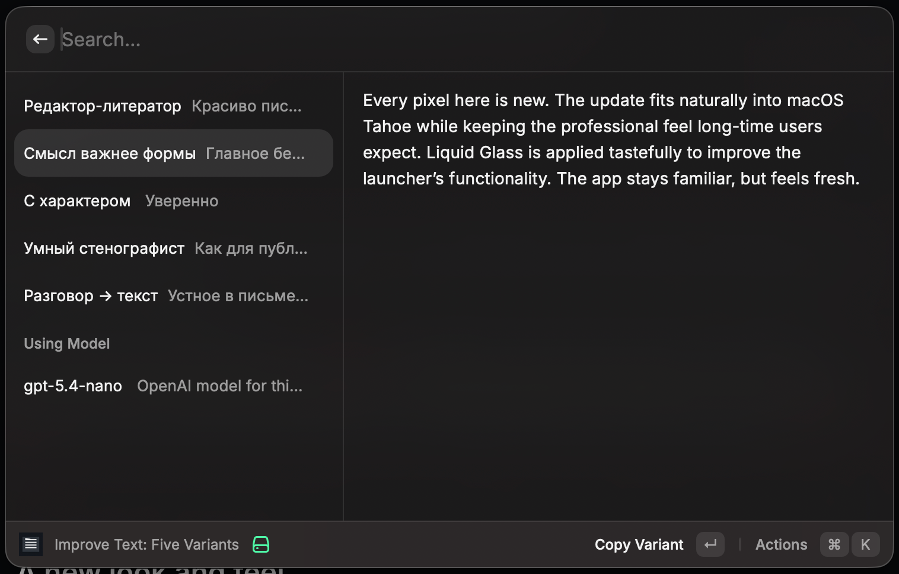

# Five Voices

Raycast AI extension that turns selected or copied text into five improved variants using your OpenAI API key.



GitHub: https://github.com/satandyh/five-voices

## Variants

1. Редактор-литератор
2. Смысл важнее формы
3. С характером
4. Умный стенографист
5. Разговор -> текст

## Install

```bash
npm install
npm run dev
```

Raycast will ask for your OpenAI API key. The key is stored by Raycast as a password preference.

Use `npm run build` to verify a production build before publishing or sharing changes.

## Use

- Run `Improve Text: Five Variants`.
- Selected text is used first; clipboard is used as fallback.
- `Enter` copies the chosen variant.
- `Cmd+Enter` replaces the selected source text when possible.
- Run `Choose OpenAI Model` to select a model available to your API key.

## Edit

- Prompt: `src/lib/prompt/prompt-template.ts`
- Constants and defaults: `src/lib/app-config.ts`
- Raycast settings defaults: `package.json`

## Privacy

The extension sends source text to OpenAI. It does not write source text, generated variants, or API keys to project files.

## Checks

```bash
npm test
npx tsc --noEmit
npm run lint
npm run build
npm audit --audit-level=moderate
```
